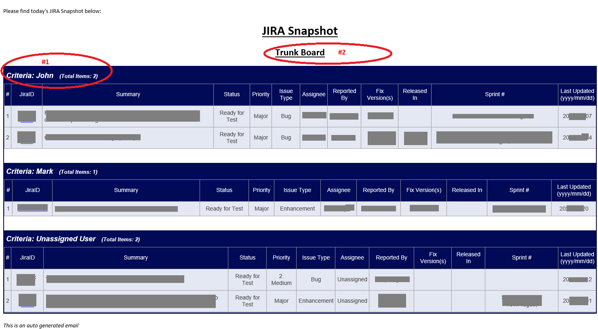

# jira-fetcher
A useful utility to be used in a team. It fetches the jiras based upon your jira filters and mails to desired stakeholders. You can set it up in jenkins or via some other scheduler to trigger automatically. It has been very useful in my team as every morning we just have to refer to this automated email to know what are our today's allocation instead of refering to different jira tickets/boards.

# Dependencies:
You would need to install python3 to make it work

Plus, you might need to install other dependent libraries. You can fetch them via pip or just google:

for eg: 
To install python jira lib refer to: https://jira.readthedocs.io/en/master/installation.html

# Configuration Part:
You will need to modify the following:

<b>JiraQuery.py file :</b>
- provide valid jira user credentials : check the comments in the file itself to locate the line to be updated
- provide jira base URL : check the comments in the file itself to locate the line to be updated

<b>Mailer.py:</b>
- from email : check the comments in the file itself to locate the line to be updated with sender's mailing address, it would be the id from which the automated mails will be sent. 
  
  <i>me = "mail_sender@your_organisation.com" </i>

- update jira url for hyperlink in the output table: (line 93)

<i>a href="https://jira.your_organisation.com/browse/</i>

<b>filters.txt:</b>

This file controls the total number of tables in the output email. Each line represent one table. Each line is pipe('|') separated into two parts: 

i) the header of the table and, 

ii) the criteria/filter based upon which the table is to be generated.

eg: 
<i>John | project = ABCD AND status in ("Ready for Test", "Test in Progress") AND assignee = John ORDER BY fixVersion DESC</i>

This line will generate a table titled "John" and will list all the jiras assigned to John from ABCD jira project which have status set to = Ready for Test or Test In Progress. Refer #1 in the screenshot.

you can add as much lines as per your requirement. 

<b>mail_settings.txt:</b>

first line in this file represents the subject of the mail sent. This line is also pipe separated. Please change the second part of the line if you need to modify the subject of your mail, do not change the keyword 'mail_subject' which is the first part of the line.

eg: you want subject of your mail to be <i>"Daily allocation of QA resources"</i>
then set the line to: 

<i>mail_subject | Daily allocation of QA resources</i>

Similarly, 
second line in this file represents the header of the Jira snapshot report.  Refer #2 in the screenshot. You can customize the header by changing the second(after the pipe) part Do not change the keyword "board_header".

Third line is the list of mailing addresses to which your emails will be sent. Separate the email addresses with a ';' and do not modify the keyword "recepients"

# Sample Report:

# Usage

To trigger this utility you would need to run the NewRunner.py which expects one argument 'the physical path' where static files (filters.txt & mail_settings.txt) are located.

If you wish, then you can also employ the attached <b><i>jiras_mailer.bat</b></i> if you have this batch at the same location as the static files. Though, You would need to modify your paths in the batch.

<h4> footnote </h4>
<i>In case you have any suggestion please feel free to report. I would try to take those up as soon as I can.

Thanks and dont forget to star my github page if you find it useful.</i>
